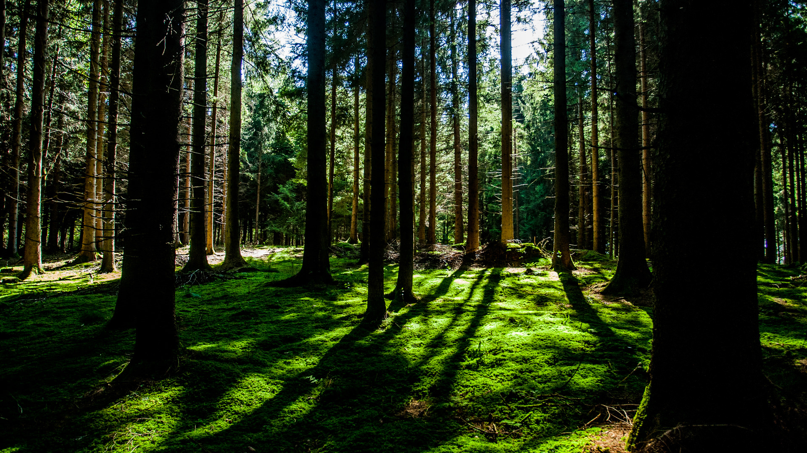

# Scrollsound Plugin

A javascript plugin which makes images play background noise when they are visible.

Demo: http://nahakiole.github.io/scrollsound/

## Usage

Create a new img tag and add a is="img-singing" attribute and a attribute sound="sound/forest.mp3".
The sound will be heard while the image is visible on the screen.

### HTML
```html

```

### Dependencies

For this to work in browser which don't support webcomponents yet, you have to include the polyfill from http://webcomponents.org/

## Contributing

[Contributing Manual](CONTRIBUTING.md)

## License

MIT License

## Used demo images and background noise
 
### Background noise

Background noise is from freesound (not all of these are used at the moment) licensed under the Attribution License.
Some of the sound is cut and compressed for usage on the web. 

Waves on a sandy beach - juskiddink
http://www.freesound.org/people/juskiddink/sounds/194868/

natural_wind - MikaF
http://www.freesound.org/people/MikaF/sounds/109976/

Morning in the countryside - inchadney
http://www.freesound.org/people/inchadney/sounds/56611/

rbh thunder storm - RHumphries
http://www.freesound.org/people/RHumphries/sounds/2523/

Bonfire -juskiddink
http://www.freesound.org/people/juskiddink/sounds/65795/

stream2.wav mystiscool
http://www.freesound.org/people/mystiscool/sounds/7138/

### Images

Images are from https://unsplash.com/license licensed under [Creative Commons Zero](http://creativecommons.org/publicdomain/zero/1.0/)
